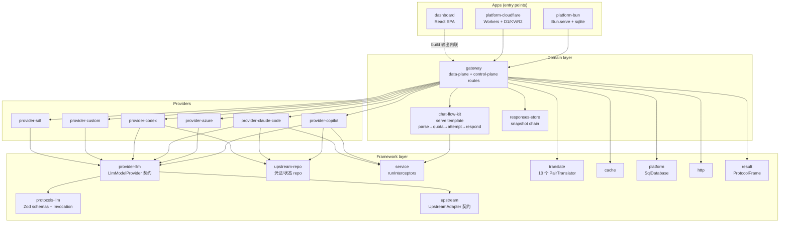
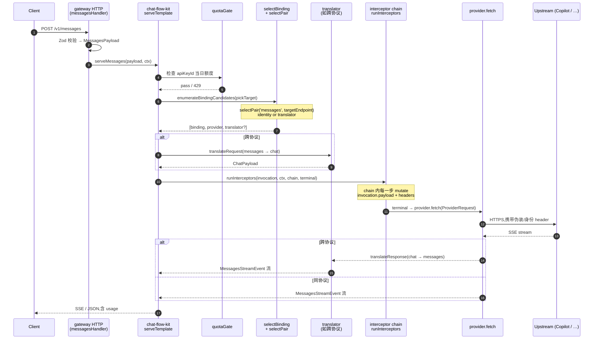
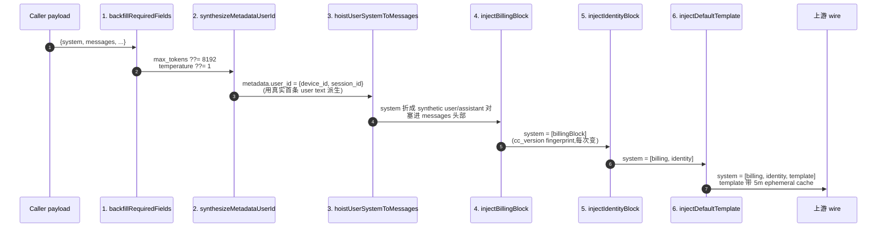
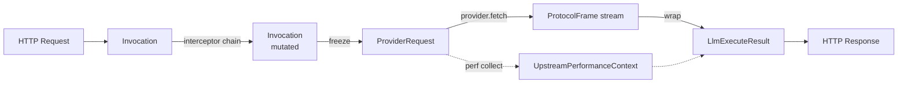

# vNext 系统设计文档

> 版本:2026-08-06 · 分支:`vNext` · 适用范围:`vnext/` 子树
> 目标读者:第一次接触 vNext 的工程师,读完能独立处理一次
> `/v1/messages` 请求从入口到 upstream 的排障

---

## 1. 定位与设计目标

vNext 是一个 **多协议、多 provider、双 runtime** 的 LLM 网关:

- **多协议**:同一网关同时对外暴露 **Anthropic Messages**、
  **OpenAI Chat Completions**、**OpenAI Responses**、**Gemini** 四种客户端
  协议。任意客户端协议可以路由到任意支持该模型的 provider(经由
  translator)。
- **多 provider**:copilot / azure / claude-code / codex / custom / sdf 六个
  上游 provider,每个 provider 独立实现 `LlmModelProvider` 契约。
- **双 runtime**:同一份代码在 **Bun**(本地 docker,`apps/platform-bun`)
  和 **Cloudflare Workers**(`apps/platform-cloudflare`)上跑;运行时差异
  全部收敛在 `packages/platform` + 各 repo/store 的 pluggable 实现里。

相较旧 `copilot-gateway/` 参考项目,vNext 的重构主线:

| 维度 | 旧项目 | vNext |
|---|---|---|
| 目录结构 | 单 package,平铺 | monorepo,20 个 workspace package |
| 协议/框架/业务 | 混在一起 | 三层清晰:framework / domain / providers |
| Provider 挂载 | 硬编码 switch | plugin 注册 + `UpstreamKind` 判别 |
| 存储 | Bun-only sqlite | 全部走接口(`SqlDatabase` / `UpstreamRepo` / …),Bun/CFW 各一套 |
| 拦截器 | 各 provider 各自实现链 | 统一 `runInterceptors<Ctx, Req, R>()` 原语 |

---

## 2. 分层与包依赖

### 2.1 高层视图



**依赖方向严格自顶向下**:apps → domain → framework;providers 只依赖
framework 与 protocols-llm,不反向依赖 gateway。

### 2.2 包职责速查

| Package | 一句话职责 | 关键文件 |
|---|---|---|
| `apps/platform-bun` | Bun 运行时入口,装配 sqlite + 本地 fs | `src/server.ts`, `src/bootstrap.ts` |
| `apps/platform-cloudflare` | Workers 入口,装配 D1 + KV + R2 | `src/bootstrap.ts` |
| `apps/dashboard` | React 管理面 SPA,build 出 `.txt` 供 gateway 内联 | `src/index.tsx` |
| `packages/gateway` | HTTP 路由、data-plane + control-plane、chat-flow 编排 | `src/app.ts`, `src/data-plane/routes.ts` |
| `packages/protocols-llm` | 四协议的 Zod 契约、`Invocation`、`LlmExecuteResult` | `src/{messages,chat,responses}/index.ts`, `src/common/invocation.ts` |
| `packages/provider-llm` | `LlmModelProvider` 抽象、`ProviderRequest` | `src/types.ts` |
| `packages/provider-*` | 六个具体上游实现 | 每包 `src/provider.ts` + `src/interceptors/` |
| `packages/upstream` | 域中立的 `UpstreamAdapter` / `ProviderResponse` / `ProbeResult` | `src/types.ts` |
| `packages/upstream-repo` | 凭证/状态原子读写 (`getById` / `saveState`) | `src/types.ts` |
| `packages/service` | `runInterceptors<Ctx, Req, R>()` 原语 | `src/index.ts:33-44` |
| `packages/translate` | 10 个 `PairTranslator`(源协议 ↔ 目标协议) | `src/*/index.ts` |
| `packages/chat-flow-kit` | serve 模板:parse → quota → attempt → respond | `src/serve-template.ts` |
| `packages/responses-store` | `previous_response_id` 链的快照读写 | `src/types.ts` |
| `packages/cache` | K/V cache 接口 + memory/KV/D1 实现 | `src/types.ts` |
| `packages/platform` | `SqlDatabase` 抽象 + env 装配 | `src/sql-database.ts` |
| `packages/http` | 重试、header 合成 | `src/index.ts` |
| `packages/result` | `ProtocolFrame<TEvent>` 判别联合 + SSE utils | `src/frame.ts` |

---

## 3. 协议契约

### 3.1 四种客户端协议

| 协议 | 客户端 endpoint | Schema | 备注 |
|---|---|---|---|
| **Messages** (Anthropic) | `/v1/messages`, `/v1/messages/count_tokens` | `MessagesPayloadSchema` in `packages/protocols-llm/src/messages/index.ts` | 原生 Claude 形态,支持 thinking / tool_use / cache_control / vision |
| **Chat Completions** (OpenAI) | `/v1/chat/completions`, `/chat/completions` | `ChatPayloadSchema` in `packages/protocols-llm/src/chat/index.ts` | messages 数组、tools、response_format、reasoning_effort |
| **Responses** (OpenAI Responses) | `/v1/responses`, `/v1/responses/compact` | `ResponsesPayloadSchema` in `packages/protocols-llm/src/responses/index.ts` | 支持 `previous_response_id` 链、`instructions`、`metadata` |
| **Gemini** | `/v1beta/models/:model/generateContent` 等 | 直通,不做 schema 校验 | 走独立 pass-through 通道 |

**Zod 校验位置**:所有校验都在 gateway 的 HTTP 层做,进 `chat-flow-kit`
之前就必须是通过校验的 typed payload。

### 3.2 标准化的中间态

四种客户端协议进入 gateway 之后,会被规约到少数几个 **中立可变态** 上,
方便后续的 interceptor / translator / provider 复用同一套代码路径:

| 类型 | 位置 | 生命周期 | 存在的原因 |
|---|---|---|---|
| **`Invocation`** | `protocols-llm/src/common/invocation.ts:9-23` | HTTP 校验之后 → provider.fetch 之前 | 拦截器可变 surface。承载 `endpoint / payload / headers / sourceApi / action / enabledFlags`。**payload 是 mutable object**,interceptor 直接修改,`next()` 无参 |
| **`ProviderRequest`** | `provider-llm/src/types.ts:30-53` | provider.fetch 的输入 | provider 契约的统一入口。`endpoint + payload + headers + sourceApi + flags + signal + timeout + action` |
| **`CanonicalResponsesPayload`** | `protocols-llm/src/responses/canonical.ts` | Responses 协议内部 | 把 `input` 的字符串简写形态 lift 成 `ResponsesInputItem[]`,让下游只需处理一种形态 |
| **`LlmExecuteResult<T>`** | `protocols-llm/src/common/result.ts` | provider.fetch 的输出 | 判别联合:成功帧 / upstream 错 / 内部错。pre-binding 错误不带 `performance`,post-binding 错误必带 |
| **`ProtocolFrame<TEvent>`** | `packages/result/src/frame.ts:14-24` | SSE 流帧类型 | 判别联合 `event / done`,让所有协议共享同一套 stream 收敛逻辑 |

### 3.3 `Invocation` 拆解

```typescript
interface Invocation {
  readonly endpoint: EndpointKey         // messages | chat_completions | responses | ...
  readonly enabledFlags: ReadonlySet<string>
  readonly sourceApi?: 'messages' | 'chat_completions' | 'responses' | 'gemini'
  action?: 'generate' | 'compact'        // 唯一非 readonly 顶层字段,shim 可 pivot
  payload: Record<string, unknown>       // Zod-validated,但类型脱敏方便 interceptor mutate
  headers: Record<string, string>
}
```

**关键设计权衡** (见 `packages/service/src/index.ts:5-9` 注释):
理想的 `next` 应该是 `(req: Req) => Promise<Result>` 传递不可变新 req,但
现状是 `() => Promise<Result>` + 共享 mutable `Invocation`。Spec 7 显式选择了
零行为变更,把不可变化留给未来 spec —— 这是 vNext 目前 **唯一的偏离
Charter §4.1 的地方**。所有 interceptor 依赖这一约定,不要擅自改回。

---

## 4. Provider 抽象与请求路由

### 4.1 `LlmModelProvider` 契约

```typescript
// packages/provider-llm/src/types.ts:64-69
interface LlmModelProvider extends UpstreamAdapter {
  readonly kind: UpstreamKind           // 'copilot' | 'azure' | 'claude-code' | ...
  readonly supportedEndpoints: readonly EndpointKey[]
  getPricingForModelKey(modelKey: string): ModelPricing | null
  fetch(req: ProviderRequest): Promise<ProviderResponse>
}
```

`UpstreamAdapter` (域中立父契约,`packages/upstream/src/types.ts`) 提供
`probe()` / `refresh()` 等通用操作;`LlmModelProvider` 补齐了 LLM 特有的
`supportedEndpoints` 和 `pricing`。

### 4.2 请求生命周期(以 `/v1/messages` 为例)



### 4.3 `selectPair()` — 源/目标协议匹配

`packages/gateway/src/data-plane/dispatch/pair-selector.ts` 负责决定:
客户端进来的是 `sourceEndpoint`(如 `messages`),provider 支持的是
`supportedEndpoints`,两者取交集,选一条 pair。

- **Identity dispatch**:sourceEndpoint 直接命中 provider 的
  `supportedEndpoints`,不走 translator。例:`/v1/messages` → provider-copilot
  (copilot 原生支持 messages)。
- **跨协议 dispatch**:不命中,走 `getTranslator(source, target)` 加载
  roundtrip translator。例:`/v1/messages` → provider-azure(azure 只支持
  chat_completions),就用 `messages-via-chat-completions` translator。

### 4.4 Upstream 选择与凭证轮换

`packages/upstream-repo/src/types.ts:16-30` 定义:

```typescript
interface UpstreamRepo {
  getById<TState>(id: string): Promise<UpstreamRecord<TState> | null>
  saveState<TState>(id: string, updater: (s: TState) => TState): Promise<void>
}
```

- **`getById`**:拉一条 upstream 配置 + 当前凭证 state。
- **`saveState`**:原子 compare-swap `state` 列。**Codex OAuth 刷新**、
  **Copilot token 轮换** 都走这里。Bun 用 `BunSqliteRepo`,CFW 用 `D1Repo`。

---

## 5. Interceptor / Boundary 模式(核心)

vNext 里 provider 特有的所有"协议适配 / 上游伪装 / 缓存对齐"逻辑,
都不写在 `provider.fetch()` 里,而是拆成 **一串 interceptor**,由通用原语
`runInterceptors` 串起来。这样做的三个好处:

1. **可测试性**:每个 interceptor 是独立函数,单测覆盖成本极低。
2. **顺序清晰**:链的顺序即"何时对何字段做何变换"的自文档。
3. **可复用**:同一个 interceptor 可以复用在多个 provider 上(如
   `withInteractionIdHeader` 在 copilot 和 claude-code 都用)。

### 5.1 通用原语

```typescript
// packages/service/src/index.ts:33-44
export const runInterceptors = async <Ctx, Req, R>(
  req: Req,
  ctx: Ctx,
  interceptors: readonly Interceptor<Ctx, Req, R>[],
  terminal: Next<R>,
): Promise<R> => {
  const run = (index: number): Promise<R> =>
    index < interceptors.length
      ? interceptors[index]!(req, ctx, () => run(index + 1))
      : terminal()
  return run(0)
}

export type Interceptor<Ctx, Req, R> = (
  req: Req,
  ctx: Ctx,
  next: () => Promise<R>,
) => Promise<R>
```

**约定**:`next()` 无参,interceptor 通过 mutate 共享 `Invocation.payload`
+ `Invocation.headers` 传值。这是 Spec 7 显式选择的偏离(见 §3.3)。

### 5.2 Copilot Messages Boundary

位置:`packages/provider-copilot/src/interceptors/messages/index.ts:31-44`,
共 **12 个 interceptor**,分两段:

```mermaid
graph LR
    subgraph "Header interceptors (前 4)"
      A1[withClaudeAgentHeaders]
      A2[withCompactHeaders]
      A3[withInteractionIdHeader]
      A4[withMessagesVisionHeader]
    end
    subgraph "Payload mutators (后 8,顺序敏感)"
      B1[withThinkingAdapted]
      B2[withTopLevelCacheControlApplied]
      B3[withCacheControlExtensionsStripped]
      B4[withEagerInputStreamingStripped]
      B5[withToolStrictStripped]
      B6[withStructuredOutputFormatStripped]
      B7[withInlineImagesCompressed]
      B8[withMessagesCacheBreakpointsAttached]
    end
    A1-->A2-->A3-->A4-->B1-->B2-->B3-->B4-->B5-->B6-->B7-->B8
```



**关键顺序约束**:

| Interceptor | 为什么这个位置 |
|---|---|
| `withThinkingAdapted` 必须在其他 payload 之前 | Copilot 上游模型对 `thinking` 块的形状要求不一样(有的要 `output_config`,有的要 top-level `thinking`);先在这里 normalize |
| `withTopLevelCacheControlApplied` → `withCacheControlExtensionsStripped` | 顺序不能反!前者会在 system[0] 自动打 `cache_control` marker,后者要把 caller 传的**以及**自动打上的都清理 `scope/ttl` 扩展字段 |
| `withMessagesCacheBreakpointsAttached` 最后 | 挂 breakpoint,依赖上面所有 payload 修改都已完成 |

**这一段外面**还会包一层 `createVariantAndBetaFilteringInterceptor`
(anthropic-beta allowlist)+ `withContextManagementBetaAligned` +
`withInitiatorHeader`,详情见 `provider-copilot/src/provider.ts`。

### 5.3 Claude Code Messages Boundary(re-mimicry 链)

位置:`packages/provider-claude-code/src/interceptors/messages/index.ts:32-43`,
**6 段链**,顺序有严格因果关系:



**每一步做什么、为什么**:

| # | Interceptor | 做什么 | 为什么必须在这个位置 |
|---|---|---|---|
| 1 | `backfillRequiredFields` | `max_tokens ??= model.limits.max_output_tokens ?? 8192`;`temperature ??= 1` | 后续所有 mutator 假设 payload 是完全成型的 |
| 2 | `synthesizeMetadataUserId` | 用 `upstreamId + 首条 user text` 做 sha256 派生 `device_id`(deterministic)+ `session_id`(UUIDv4 stamp),写入 `metadata.user_id` | **必须在 hoist 之前**——hoist 会往 messages 头插 synthetic 对,session_id 应该基于 operator 真实文本,不是合成物 |
| 3 | `hoistUserSystemToMessages` | 把 caller 的 `system`(字符串或 block 数组)折成 `[{role:'user', content:<原 system>}, {role:'assistant', content:'Understood. I will follow these instructions.'}]`,塞在 messages 头部 | 腾出 `system` slot,让下面三段 mimicry block 独占 |
| 4 | `injectBillingBlock` | `system = [billingBlock]`,内容含 `cc_version` 每请求变化的 3 hex fingerprint | **必须在 cache anchor 之前** —— 每次变的 fingerprint 若落在 identity/template 后面,会污染缓存前缀,cache miss 拉满 |
| 5 | `injectIdentityBlock` | append 到 `system[1]`,canonical CC identity 文本 | 通过上游身份校验的必需件 |
| 6 | `injectDefaultTemplate` | append 到 `system[2]`,带 `ephemeral 5m` cache_control | 受 **4-breakpoint cap** 保护:如果 caller 已经打满 4 个 cache_control breakpoint,自动降级为无 cache 版本,避免上游 400 |

**为什么要这样伪装**:参考项目 `copilot-gateway` 实测:不伪装 → identity
校验失败 400 / prompt cache 命中率 0 / mimicry 不完整。这一整套是**上游反爬
的对抗性适配**,不是可选优化。

### 5.4 Responses Compact Shim

位置:`packages/gateway/src/data-plane/chat-flow/responses/interceptors/with-responses-compact-shim.ts`

- 客户端 hit `/v1/responses/compact` → gateway 把 `Invocation.action` 置为
  `'compact'`
- 该 shim 检测到 `action === 'compact'`,重写 payload 成 `'generate'` 形态
  (在 messages 尾部 append 一条 "please summarize above" 指令)
- pivot `action` 为 `'generate'`,后续标准 generate 通道处理

**为什么用 shim 而不是 provider 分支**:大部分上游(copilot/openai-style)
根本没有 `compact` endpoint,只有 codex 有独立的
`/responses/compact` wire —— shim 让**上游无差别**成为可能,codex provider
读 `ProviderRequest.action` 走真的 compact wire,其他 provider 只见到普通的
`generate`。

---

## 6. 业务标准化结构

从客户端 HTTP 请求到 upstream HTTP 请求,vNext 在中间引入了 **5 个核心值对象**
把业务抽象成可复用的形态。每个值对象都对应管道中的一段职责边界。

### 6.1 五个核心值对象

| 值对象 | 定义位置 | 出现层 | 生命周期 | 判别方式 |
|---|---|---|---|---|
| `Invocation` | `protocols-llm/src/common/invocation.ts` | data-plane 入口 → provider.fetch 前 | pre-dispatch 可变态 | 结构类型 |
| `ProviderRequest` | `provider-llm/src/types.ts` | binding 选定后 → provider 内部 | 单次调用不可变 | `sourceApi` + `action` |
| `LlmExecuteResult<T>` | `provider-llm/src/types.ts` | provider.fetch 返回 → chat-flow-kit | 单次调用 | discriminated union (`ok`) |
| `ProtocolFrame<TEvent>` | `result/src/frame.ts` | SSE 流的每个 chunk | 流式产物 | `type: 'event' \| 'done'` |
| `UpstreamPerformanceContext` | `upstream/src/types.ts` | provider.fetch 开始 → 请求结束 | 累积可变态 | 结构类型 |

### 6.2 为什么是这五个,分别封装了什么

**`Invocation`——协议无关的可变 surface**

拦截器链需要一个既能读又能改的对象:改 headers、改 payload、改 action、
甚至从 `generate` pivot 到 `compact`。如果直接传原始 HTTP request,拦截器无
法插入自己的字段(dev-auth、interaction-id、cache_control 等)。抽象成
`Invocation` 后,拦截器契约稳定,协议无关。

```ts
interface Invocation {
  sourceApi: 'messages' | 'chat' | 'responses' | 'gemini'
  action: 'generate' | 'compact' | 'count_tokens'
  endpoint: string
  headers: Record<string, string>
  payload: unknown            // 尚未经过 zod 校验的原始 JSON
  flags: Record<string, boolean>
}
```

**`ProviderRequest`——到 provider 的稳定契约**

拦截器链跑完后,payload 已经"上游合规"。此时 freeze 成 `ProviderRequest`
交给 provider —— provider 收到的一定是一个已经通过 zod、已经打好 headers、
已经装配好 cache_control 的对象。provider 只负责 "发出去 + 组装 result"。

```ts
interface ProviderRequest {
  sourceApi: SourceApi
  action: ProviderAction
  endpoint: string
  headers: Record<string, string>
  payload: unknown
  providerData: ProviderData   // provider 私有:upstreamModelId 等
}
```

**`LlmExecuteResult<T>`——三态返回避免 throw over the wire**

provider 可能返回三种结果:成功、上游 4xx/5xx、内部逻辑错。以往用 throw +
try/catch 混合,难对齐观测埋点。改成判别联合后,chat-flow-kit 可以直接
`switch (result.ok)` 决定走 respond 还是走 fail-path。

```ts
type LlmExecuteResult<T> =
  | { ok: true;  frame: T; performance: UpstreamPerformanceContext }
  | { ok: false; kind: 'upstream'; status: number; body: unknown }
  | { ok: false; kind: 'internal'; error: Error }
```

**`ProtocolFrame<TEvent>`——统一 SSE 判别联合**

四种协议的 SSE 事件格式完全不同(Anthropic 有 `content_block_start`、OpenAI
有 `chunk.choices[].delta`、Gemini 有 `candidates[]`)。但 chat-flow-kit
只关心"这是一个事件"还是"流结束了"。所以在 provider 层把每种协议的事件
包裹进 `ProtocolFrame`:

```ts
type ProtocolFrame<TEvent> =
  | { type: 'event'; event: TEvent }
  | { type: 'done'; usage?: UsageMetrics }
```

统一后,上层的重试、切换 provider、埋点、断流恢复,全部与协议解耦。

**`UpstreamPerformanceContext`——观测的"背包"**

时间戳(first_byte / last_byte)、token 计数(prompt/completion/cache)、
是否重试、上游 request-id —— 这些数据在 provider 内部一步步累积,最终随
`LlmExecuteResult.performance` 一起冒泡。计费、限流、dashboard、日志都读同
一个对象,不再各自 patch data-plane。

### 6.3 值对象之间的转换



关键约束:**每次转换点都是一次不可逆的形态锁定**,后续代码就无法退回上一
层的可变态。这保证了拦截器只能在 `Invocation` 阶段修改 payload,provider 只
能读 `ProviderRequest`,chat-flow-kit 只能读 `LlmExecuteResult`。

---

## 7. 存储与平台抽象

vNext 通过接口把持久化剥离运行时,同一份 domain/framework 代码不改一行地在
Bun 和 Cloudflare Workers 两套 runtime 上跑。

### 7.1 接口 vs 实现

| 接口 | 用途 | Bun 实现 | CFW 实现 |
|---|---|---|---|
| `SqlDatabase` | 通用 SQL 抽象(prepare/exec/all) | `BunSqliteDatabase`(基于 `bun:sqlite`) | `D1Database`(CFW 原生 binding) |
| `UpstreamRepo` | OAuth 凭据 CRUD + `saveState` CAS | `BunSqliteRepo` | `D1Repo` |
| `ResponsesSnapshotStore` | Responses snapshot 链存储 | `InMemoryResponsesSnapshotStore`(local dev)/`BunSqliteResponsesStore` | `D1ResponsesStore` |
| `Cache` | KV 语义(get/set/ttl) | `MemoryCache` / `BunSqliteCache` | `KVCache`(CFW KV) / `D1Cache` |
| `FileProvider` | 附件/blob 存储 | `FsFileProvider`(本地文件系统) | `R2FileProvider`(CFW R2) |

### 7.2 两套完全独立的数据库

**关键约束**:本地 Bun sqlite 与 CFW D1 是**两套独立库**,任何一方的迁移
必须在对应 runtime 单独跑一遍。参考 memory `storage_split_local_vs_cfw`:

- 本地:`./data-vnext/vnext.db`(容器内 volume `./data-vnext:/data`)
- CFW:D1 binding,通过 wrangler `d1 migrations apply` 部署

这也意味着 dashboard 登录、OAuth token、responses snapshot 在两个环境是完全
隔离的,不存在"本地测过就等于生产 OK"。

### 7.3 `UpstreamRepo.saveState()` 的原子性

OAuth refresh 是**并发热点**:多个请求同时命中过期 token,如果每个都各自
刷新会撞出多次 upstream token 换发。`saveState()` 用 optimistic CAS
(`WHERE version = ?`)保证:

- 只有拿到最新 version 的那次刷新能成功
- 其他并发协程读到新 token 后直接复用,不重复刷新

Bun / D1 两个实现都必须遵循这个契约,repo 单元测试用同一份 spec 分别验证。

---

## 8. Auth / Identity / Quota (横切关注点)

三条横切链路,穿过所有 domain 逻辑。

### 8.1 会话 Auth(Dashboard)

- Google OAuth(`packages/gateway/src/control-plane/auth/*`)
- 落库到 `sessions` 表,cookie `vnext_sid`
- 只保护 control-plane 路由(dashboard、admin API),不影响 data-plane

### 8.2 Dev Auth(本地绕过)

`packages/gateway/src/control-plane/auth/dev-auth.ts` 检查:

- `VNEXT_DEV_GITHUB_TOKEN` — 直接注入 github oauth token
- `VNEXT_DEV_COPILOT_TOKEN` — 直接注入 copilot access token

**仅本地 docker 生效**,CFW 环境显式拒绝以避免生产泄漏。参考 memory
`storage_split_local_vs_cfw` —— 生产环境凭据完全走 D1 的 UpstreamRepo。

### 8.3 Quota Gate(fail-open)

`packages/gateway/src/data-plane/chat-flow/shared/quota-gate.ts`:

- data-plane 每个 attempt 前查一次 quota
- **fail-open**:quota 服务本身出错时放行,不阻塞用户请求(observability 会
  报警,但不阻断)
- 触发限流时返回 **Anthropic-shape 429**:
  ```json
  { "type": "error", "error": { "type": "rate_limit_error", "message": "..." } }
  ```
  即使客户端用的是 OpenAI SDK,也把 429 body 归一到 Anthropic 语义 —— 客户
  端拿到的 shape 是稳定的,SDK 层由 chat-flow-kit 反向翻译。

---

## 9. Dashboard 装配

Dashboard(`apps/dashboard/`)是内嵌在网关里的 React SPA,不走 CDN、不走
独立部署 —— 目的:**单一 HTML 响应即可访问**,ops 只需要打开网关本身的
URL,不用配额外域名/CDN。

### 9.1 构建流程

```
apps/dashboard/src/         (React + Tailwind 源码)
     │  bun build + tailwindcss
     ▼
apps/dashboard/dist/dashboard.js.txt   (打包好的 JS,text 后缀便于 import)
apps/dashboard/dist/dashboard.css.txt  (打包好的 CSS)
     │
     │  text import (Bun/CFW 都支持)
     ▼
packages/gateway/src/control-plane/dashboard/page.ts
     │  inline 成单个 HTML,一次性下发
     ▼
GET /dashboard  →  200 text/html
```

### 9.2 Chart.js 的处理

之前是 `<script src="https://cdn.jsdelivr.net/npm/chart.js">` 引入(见 commit
`d95f125` 之前的历史)。这带来两个问题:

- CFW 部署到防火墙受限环境时无法访问 CDN
- CDN 版本漂移导致偶发 breaking

`d95f125` 后改成 **tree-shaken bundle 进 dashboard.js.txt**,只打包实际用到
的 Chart 组件(`Line` / `Bar` + 必需的 scale / plugin),包体积增加约
30KB gzip,但完全离线可用。

---

## 10. 部署形态

### 10.1 两套运行时对比

| 维度 | Bun 本地(docker) | Cloudflare Workers |
|---|---|---|
| 入口 | `apps/platform-bun/src/bootstrap.ts` | `apps/platform-cloudflare/src/bootstrap.ts` |
| 部署单元 | `docker-compose.vnext.yml`(端口 41414) | `wrangler deploy` |
| 存储 | `bun:sqlite` + 本地 fs | D1 + KV + R2 |
| 进程模型 | 长驻 Bun 进程 | 每请求隔离 worker 实例 |
| 冷启动 | 无(容器常驻) | 有(V8 isolate 启动 ~5ms) |
| 数据持久化 | `./data-vnext:/data` volume | D1(全球复制) |
| 重启行为 | volume 保留,sqlite 数据在 | worker 无状态,数据全部在 D1 |
| Dev auth 支持 | 支持(`VNEXT_DEV_*` 环境变量) | 显式拒绝 |
| 适用场景 | 本地开发 / 内网试运行 | 生产、边缘分发 |

### 10.2 本地 docker 部署

```yaml
# docker-compose.vnext.yml (关键片段)
services:
  vnext:
    build: { context: ., dockerfile: vnext/apps/platform-bun/Dockerfile }
    ports: ["41414:41414"]
    volumes: ["./data-vnext:/data"]
    environment:
      VNEXT_DEV_GITHUB_TOKEN: ${VNEXT_DEV_GITHUB_TOKEN:-}
```

对应 SSH 部署:参考 memory `ssh_deploy_location`
(`/home/xian/dockers/copilot-api-gateway`,`docker compose -f
docker-compose.vnext.yml up -d --build`)。

### 10.3 CFW 部署

```
wrangler.toml:
  d1_databases    = [{ binding = "DB", database_name = "vnext" }]
  kv_namespaces   = [{ binding = "CACHE", id = "..." }]
  r2_buckets      = [{ binding = "FILES", bucket_name = "vnext-files" }]
```

**重要约束**:必须走 `deploy:full`(参考 memory `deploy_workflow`)—— 先
`d1 migrations apply` 再 `wrangler deploy`,顺序反了会导致代码引用还没建的表
而返回 500。

---

## 附:排障 checklist

一个 `/v1/messages` 请求异常时,按下列顺序自查:

1. **入口协议识别**:请求打到了 `messages` / `chat` / `responses` / `gemini`
   哪一个 route?(看 `packages/gateway/src/app.ts` 的路由表)
2. **Binding 选择**:UpstreamKind 是什么? (`select-binding.ts`)
3. **Translator pair**:是否跨协议? 如果是,反向 translator 是否装配?
4. **拦截器链**:看 provider 的 `messagesPayloadInterceptors` 是否有拦截器
   报错(添加临时 `console.log(ctx)` 定位)
5. **Upstream 请求形态**:开 `VNEXT_DEBUG_UPSTREAM=1` dump 实际发出的
   headers + body
6. **Repo/store 层**:D1 vs 本地 sqlite 迁移是否一致?(参考 memory
   `common_pitfalls`)

---

*文档结束。如需修订,请连同实际代码变更一起提交 PR,避免文档漂移。*
