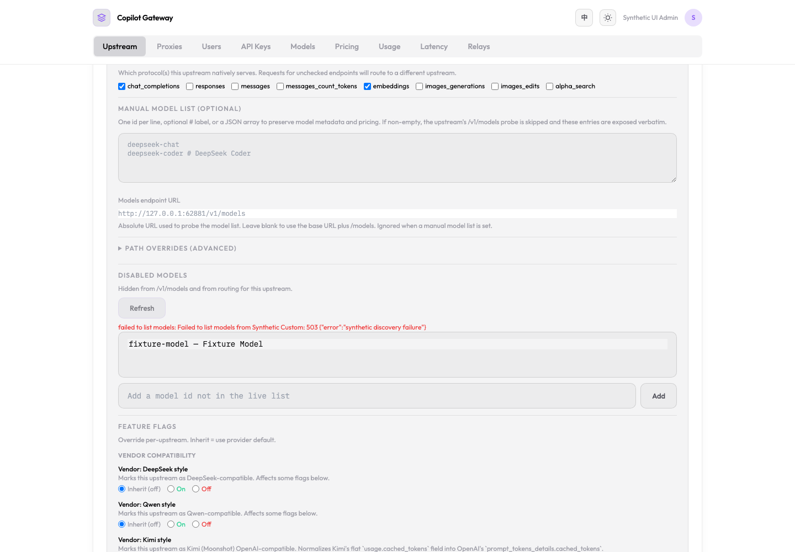

# Cached catalog editor browser acceptance

Validated 2026-09-29 with the C03/C04 initial patch on clean base `e1ae892e`. Real Bun bootstrap, gateway routes, React dashboard, temporary SQLite, and a loopback-only synthetic provider; no production data, configuration, or paid inference. The complete initial `ci:local` run passed (4003 tests, one skip, zero failures) before browser launch. Alias capability corrections are validated separately by route regressions.

The attached fixture and Playwright script reproduce the interaction. Their absolute source and installed Playwright paths are machine-specific and must be adjusted on another checkout. Run the fixture from a new temporary directory with only PATH/HOME inherited; it writes its disposable connection details there. Run the script beside that connection file. Stop only the fixture PID when done. Do not reuse production databases or credentials.

Observed assertions:

- Dashboard model fetch warmed the shared cache with one discovery call. Opening Edit returned the cached model without increasing that count.
- After switching the loopback provider to a synthetic 503, explicit Refresh returned 502, displayed the failure, and retained the exact option list.
- Editing the unsaved discovery URL disabled Refresh.
- No browser JavaScript errors occurred.

The synthetic provider validates local cache/UI behavior, not live-provider compatibility or C02 cross-instance SQL fencing. The dedicated server was stopped after the test.
