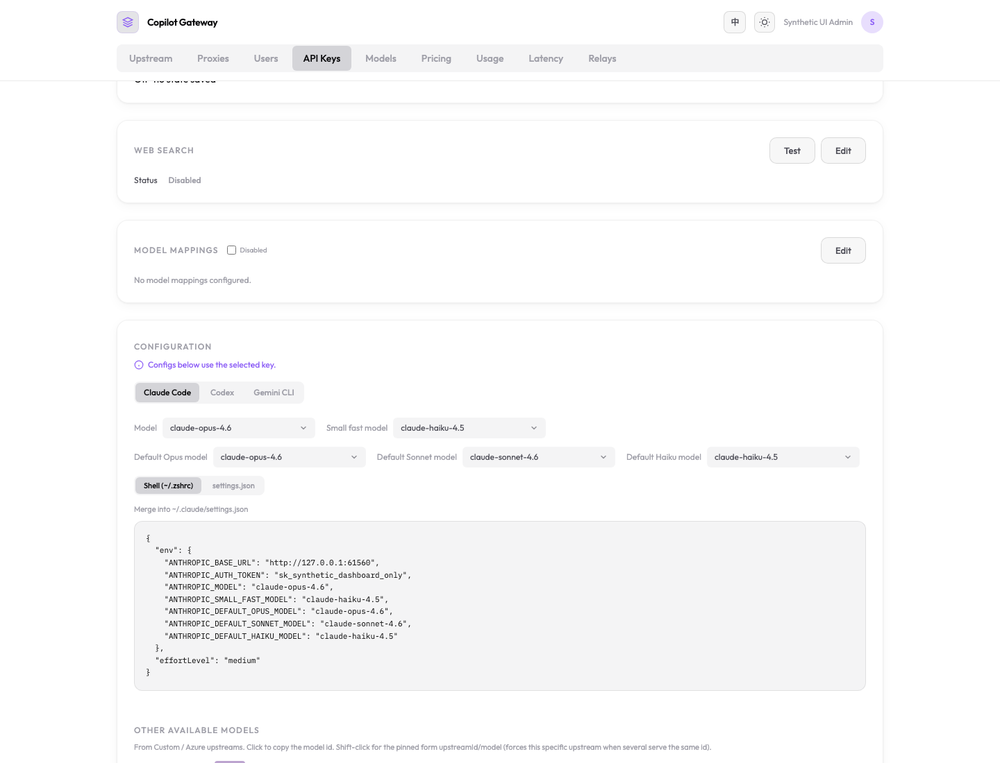

# Independent Claude Code tier browser acceptance

Validated 2026-09-29 against the final D09 and catalog endpoint follow-up patches on base `b9c98a3f`. Real React dashboard, gateway routes, Bun bootstrap, fresh temporary SQLite, two synthetic API keys, and three manual Custom Claude models configured for Messages. The listener was ephemeral and loopback-only; no real provider request or local Claude configuration was used. The final clean source CI passed: 4023 tests, one skip, zero failures; all typechecks, purity, lint (36 inherited warnings), UI build, and Workers dry-run passed.

The initial browser fixture exposed an inherited catalog bug: valid Custom manual and discovered rows lacked `supported_endpoints`, so the existing dashboard excluded their Claude models. The follow-up derives missing fields from configured callable bindings, preserving explicit raw fields. Review additionally caught embedding/image/default-chat inference outside configured endpoints; the final correction and regressions close that gap. This same manual-model browser scenario then passed on the final source.

Observed assertions:

- No default-tier override is emitted initially.
- Opus, Sonnet and Haiku selectors independently populate shell and JSON snippets.
- Selecting tiers preserves the primary model.
- Clearing Sonnet removes only its override and retains Opus.
- Switching API keys resets optional tier selections.
- No page JavaScript errors occurred.

The attached fixture/script use machine-specific source and installed Playwright paths. Adjust those paths for another machine, copy both files into a new temporary directory, start the fixture there with only PATH/HOME inherited, and run the script beside its disposable connection file. The fixture creates synthetic sessions/keys only. Its dedicated PID was stopped after validation. Shell quoting has a separate automated Bash roundtrip test; the browser does not execute snippets or write CLI settings. This does not claim live Claude-client inference validation.
