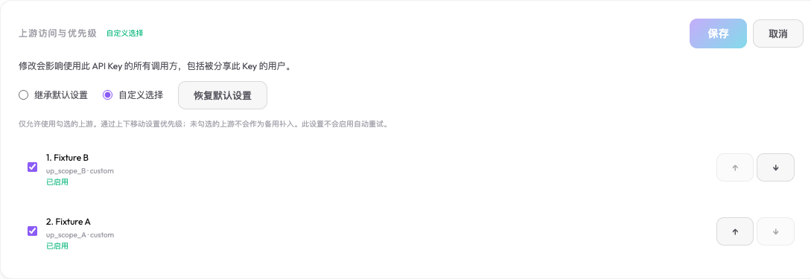

# Key upstream access validation

Date: 2026-10-09. Base revision: `8f3a0d62188994fdeb369a69891bfb626ac313fd`.

## Delivered contract

The API Key editor combines access and priority in one setting:

| Setting | Meaning |
| --- | --- |
| `null` or a legacy missing field | Inherit visible upstreams and their existing default order |
| `["B", "A"]` | Allow only B and A, selecting duplicate models in that order |
| `[]` | Allow no upstream; publish an empty model catalog |

Key model mappings run before scoped model selection. Visibility is still the Key owner's upstreams plus global upstreams. Pins, affinity, count-token calls, image/embedding requests, WebSocket turns, and provider-backed helpers remain inside the whitelist. Disabled/deleted/invisible references do not widen scope. This adds no automatic request replay or upstream failover.

The Dashboard location is **API Keys → expand a Key → Upstream access & priority**. The editor supports inheritance, custom selection, up/down ordering, restoring defaults, missing and disabled references, and preserved drafts after failures. Changes affect all callers of that Key.

## Credential and update boundaries

Management requires an authenticated owner, assigned user, or administrator according to the existing Key management contract. Possession of an API Key does not grant its owner's management identity. API Key self-service reads, usage, pricing, capabilities, and heartbeat keep their dedicated paths. API-key login metadata no longer advertises user management privileges.

Device authorization also requires an account login. An API Key cannot be exchanged for a full user session, because that would lose both its upstream policy and its revocation binding. Existing account-session and legacy User Key device flows retain their authentication-time semantics.

Configuration updates use field-local SQL patches. Rotation, renaming, last-used updates, and web-search copying cannot overwrite a concurrent whitelist change with a stale full Key object. Scope updates invalidate SQLite and D1 configuration snapshots. The routing change uses existing snapshots and adds no hot-path SQL lookup or per-Key copy of the full model catalog; this is source-level verification, not a new latency/CPU/memory benchmark.

## Evidence

- Real SQLite tests cover legacy migration, nullable/ordered/empty scope, invalid persisted values, permissions, atomic mixed patches, concurrent field updates, and cache invalidation.
- Actual local Miniflare/workerd D1 tests cover migration 0023, policy round trips, revisions, atomic patching, and last-used updates.
- Routing tests cover the four chat protocols and forced translation paths, catalog metadata, explicit pins, affinity, non-chat endpoints, provider-backed helpers, and fresh authentication on subsequent WebSocket turns.
- Real credential tests cover control-plane projection, self-service compatibility, and concurrent scope revocation during rotation/rename/touch/web-search copy.
- Independent review found and closed the owner/global Copilot ordering regression and stale full-row update issue. The final storage/UI and routing reviews have no unresolved findings.
- [Browser acceptance](browser-acceptance.json) records actual UI operations and final requests against an isolated Bun application, real in-memory SQLite, and two local stub upstreams. It covers B→A selection, A-only pin rejection, empty scope, inherited defaults, save/load failures, unavailable references, translated controls, and real bearer-versus-management-session behavior.

The browser fixture uses test identities and simulated upstream outputs. These checks do not claim production OAuth, native provider network compatibility, or deployed performance measurements.

## Migration and rollback

Migration `0023_api_key_upstreams.sql` is additive and defaults existing keys to inheritance. Apply migrations before starting a newer binary. No deployed database or runtime was modified in this task.

Older binaries ignore this whitelist. A rollback to an older image therefore requires retaining whitelist enforcement or taking affected restricted credentials out of service first. An older configuration backup without the field also represents inheritance; do not use it to restore restricted credentials while expecting the new access boundary to survive.

## Integration status

- Feature implementation: `64785b83` (`feat(vnext): add ordered upstream access per API key`). Historical instrumentation unit fixtures: `64eb632e`. Both were fast-forwarded into local `vNext` under the existing integration authorization.
- Full `bun run ci:local` exited 0 in the isolated worktree: framework purity, workspace typechecks, **6,630 passed / 2 skipped / 0 failed** across 604 test files, ESLint, Dashboard build, and Cloudflare Workers deployment dry-run. The skips are the optional installed-native-Codex parser check and the runtime-specific X25519 failure case. The dry-run published nothing.
- Final independent identity review found no remaining findings: 84 focused tests passed, plus eight real-SQLite checks across both `/auth/device/verify` and `/api/auth/device/verify`, covering restricted API Keys, account sessions, and legacy User Keys.
- After integration, **175 tests passed / 0 failed** across nine files combining the new policy, real-SQLite credential boundaries, Responses sessions, and the existing collaboration overlay. Gateway and protocol-package typechecks also exited 0.
- All 38 pre-existing dirty/untracked files were preserved: 37 retained their exact SHA-256 bytes; the overlapping Responses attempt file retained its original bytes after excluding the feature's single added `upstreamIds` line. None of these unrelated edits were committed.
- Raw local logs, task reports, and preservation receipts are retained under the main checkout's ignored `.superpowers/sdd/2026-10-09-key-upstream-access/` directory. The checked-in browser receipt and screenshot above contain only test identities.

No push, Docker/CFW/SSH deployment, live database migration, or new performance benchmark was performed. Migration and rollback requirements above apply when a deployment is requested.
