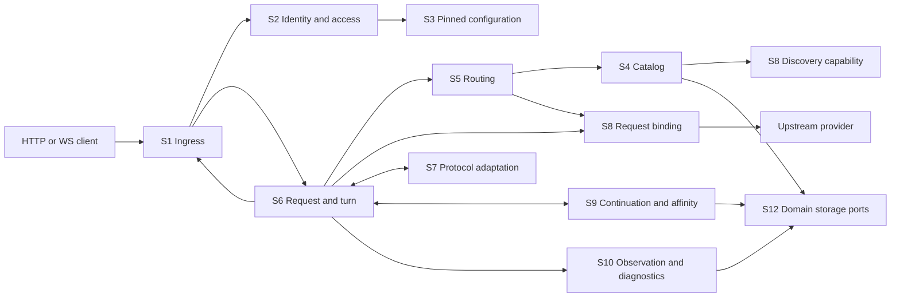
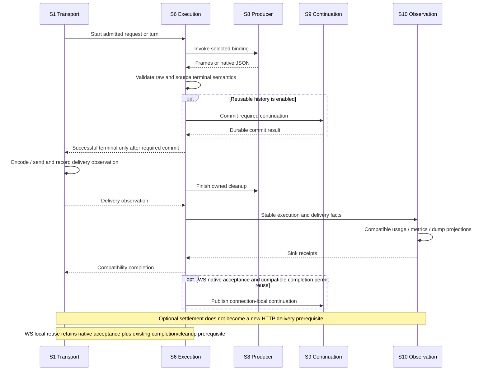

# vNext subsystem architecture

Date: 2026-09-30. Status: proposed subsystem contracts following source review; not an implementation or release qualification.

Source baseline: local `vNext` at `52e7ad67e88e15122bff50087588f37b3e3216e4`, including the preserved collaboration overlay. The [review and source map](../research/2026-09-30-subsystem-architecture/README.md) distinguish confirmed code paths, structural gaps and decisions requiring behavioral validation. The preceding [request-boundary batch](../research/2026-09-30-cfw-resource-remediation/request-boundaries-results.md) is already implemented. This document adds no runtime change, test, resource measurement or deployment.

This is the responsibility/collaboration view of the system. The complementary [quality-attribute assessment](2026-09-30-vnext-quality-attribute-architecture.md) evaluates the same architecture through maintainability, stability, extensibility and performance, including direct Floway source comparisons and decisions about early refactoring. These views overlap; neither implies a new deployment or package for each subsystem.

## 1. Decision

Keep a modular monolith with two host adapters, a portable gateway, provider plugins and protocol libraries. Organize the next changes around ownership and public contracts within the existing modules. A subsystem is a logical responsibility, not necessarily a package, database or deployed service.

The present separation of platform, provider, protocol and repository code is useful. The weaker boundaries are between authority and cached views; catalog data and executable capabilities; producer shape and telemetry metadata; and semantic completion, delivery, cleanup and diagnostic persistence. Fix those seams before moving directories or generalizing every endpoint into one execution engine.

| Option | Consequence | Decision |
| --- | --- | --- |
| Only continue local allocation edits | Preserves behavior but leaves ownership implicit and allows new work to repeat it | Insufficient as the architecture direction |
| Define subsystem contracts and migrate selected seams inside the monolith | Preserves native protocol/CFW semantics while making authority, buffering and completion reviewable | Recommended |
| Replace the framework, split network services or introduce a universal execution context/event bus | Adds transport, state, serialization and operational costs without resolving the demonstrated contracts | No current justification |

## 2. Subsystem map

Names below describe the target ownership map. Existing files can serve several contracts during migration; new port names are proposals, not current exports.

| ID | Subsystem | Owns | Main current implementation | Principal collaborators |
| --- | --- | --- | --- | --- |
| S1 | Host runtime and ingress | Bun/CFW wiring, request capabilities, HTTP/WS delivery and native pressure | `apps/platform-*`, `platform`, gateway HTTP/WS adapters | S2, S6, S11; injects S12 adapters |
| S2 | Identity and access | Principal resolution, operation policy, user sessions, caller API keys, one-time challenges | `shared/credential-auth`, `control-plane/auth`, key/ownership routes | S3 read views, S12 authoritative commands |
| S3 | Configuration authority and views | Coherent generations, pinned views, invalidation, freshness policy | `repo/configuration-cache`, `repo/index`, revision triggers | S12; supplies S2/S4/S5 |
| S4 | Model catalog authority | Discovery, publication identity, leases, stale/explicit/cache-only reads, retention | `providers/catalog-coordinator`, `repo/catalogs`, shared catalog SQL | S3, S8 discovery port, S12 |
| S5 | Routing and binding assembly | Model mappings, visibility, eligibility, ordered ranking, metadata projection and materialization | `routing/*`, `providers/registry`, `routing-projection`, affinity selection | S2/S3 grants, S4, S8, S9 authority checks |
| S6 | Request, turn and session execution | Preparation order, attempts, iterator ownership, cancellation, lifecycle prerequisites, execution facts | `chat-flow/*`, shared helpers, `chat-flow-kit` | S5, S7, S8, S9, S10; S1 consumes output |
| S7 | Protocol adaptation | Schemas, body/event codecs, source/hub conversion, source-shaped results | `protocols-llm`, `translate`, `source-result`, conversion within translator traversal | Pure result/service primitives; called by S6 |
| S8 | Provider execution and egress | Provider semantics, credential refresh/effects, actual execution identity, HTTP/socket/proxy I/O | `provider-*`, `provider-llm`, `dial`, `http`, `proxy`, upstream repo ports | S12 credential commands, S1 platform ports; called by S4/S5/S6 |
| S9 | Continuation and affinity | Key-scoped history, commit-before-reuse, connection-local continuation, authenticated opaque-state ownership | Responses store bridge/writer/local continuation, `responses-store`, affinity modules | S12; S5/S6 ask for authority/continuation |
| S10 | Observation and diagnostics | Usage/performance projections, capture policy, dump encoding/publication and readback | telemetry helpers, metrics, `shared/dump`, dump store | S6 immutable facts, S8 exchange observations, S12 |
| S11 | Management and integrations | Account/key/proxy commands, dashboard queries, setup leases/artifacts, Agent Remote handoff | `control-plane`, `apps/dashboard`, `setup-local` | S2/S3/S4/S8/S10 public operations, S12 |
| S12 | Persistence and maintenance | SQL/file adapters, transactional commands, object publication fences, expiry and garbage collection | gateway repositories, host DB/file adapters, maintenance modules | Called through domain ports; does not choose routing or success policy |

S1 and S12 are infrastructure ownership boundaries. S2–S11 are application/domain boundaries. Core frame, middleware and transport utilities are shared primitives, not autonomous application subsystems. Setup and Agent Remote are separate management workflows within S11; inference does not acquire their state.

### Execution collaboration view

Arrows show logical calls/data exchange, not an exhaustive import graph. Physical adapters are injected at host bootstrap.

The management plane calls explicit read/command ports of the same subsystems. It may ask S4 to discover a catalog or S8 to refresh credentials; a metadata GET must not implicitly start those operations. Its UI projections are distinct from the inference execution graph.

## 3. Responsibilities and public contracts

### S1 — Host runtime and ingress

Host apps construct concrete SQL/file/cache/image/socket adapters and mount the gateway. Gateway modules compose application policy. These are two composition levels, not competing service containers. Keep packages independent of host apps and continue importing through package exports.

Separate isolate-lifetime `PlatformCapabilities` from request-lifetime `RequestCapabilities`: the latter contains cancellation, background registration and native transport pressure/delivery operations. Pass only the needed capability to a collaborator. Do not put request bodies, credentials, a writable Repo and every service on one shared context.

Current CFW HTTP and WS paths scope their executor explicitly; catalog and dump capture now retain the originating executor. Remaining ambient configuration/token helpers and the bootstrap fallback are migration seams, not evidence that every current call uses the wrong request. Scheduled maintenance needs its own invocation scope if it later schedules detached work; current sweeps are awaited. Bun observes detached rejection but has different native pressure/lifetime semantics from CFW.

Transport owns HTTP serialization, SSE demand and WS send acceptance. It cannot decide that a failed turn succeeded or publish connection-local reuse independently. Native send acceptance does not prove peer receipt.

### S2 — Identity and access

Use a named operation policy after credential resolution: `authenticate -> Principal`, then `authorize(principal, operation, resource) -> Grant`. Keep transport extraction separate: HTTP legacy extraction and WS header-only extraction are intentionally different. An API key identifies a gateway caller; it is not a provider refresh token or an affinity proof.

`SessionLifecycle.revoke` must own durable revocation and local cache invalidation. SQL revision propagation remains the cross-instance mechanism. The current omitted `deleteByToken` notification is a priority correction, not a reason to remove the shared cache. Define the policy for requests admitted before revocation separately from subsequent admissions.

API-key owner-disable behavior needs an explicit compatibility decision: current WS checks the owner, while HTTP's default resolver does not. Preserve and name the exception until that decision is implemented; structural cleanup must not silently choose the policy.

One-time OAuth/email/magic challenges need a `consume(binding, now)` contract that guarantees expiry and single use at the authoritative store. The current KV read/delete pair does not establish atomic consumption. Reuse conditional repository commands where suitable; this is a separate control-plane correction, not inference overhead.

### S3 — Configuration authority and views

SQL rows and revision triggers remain authority. Publish a coherent immutable snapshot only after matching before/after revisions and local mutation epoch. Pin one generation for ordinary inference, retain the existing HTTP lease, and preserve fresh session/configuration checks per WS turn.

The pinned generation is an admission/configuration read view, not a freeze of every authority observation. Catalog rechecks may accept a newer generation under the existing incarnation/owner/provider/visibility rules; credential recovery also observes current state. Preserve these exceptions without introducing a new read on every cache hit.

Replace the full writable `Repo` exposed by the pinned view with purpose-specific read capabilities: `AuthConfigurationView` and `RoutingConfigurationView`. Return shared immutable descriptors where callers do not mutate them; retain explicit copies at mutable execution boundaries. Authoritative credential recovery, quota observations and continuation reads must use named ports rather than accidental proxy fallback methods.

Mutation commands must report affected authority/invalidation at the same boundary that commits the mutation. A typed exhaustive decorator is an acceptable transitional implementation; a manually maintained list of method names is not the long-term contract. Do not add a DB read to each warm request merely to make dependencies look cleaner.

### S4 — Model catalog authority

Own `read(mode, expectedIdentity, visibility, signal, background)`, discovery lease acquisition, publication and failure receipts. Keep adapter revision, row incarnation, configuration generation/fingerprint and owner/provider in `CatalogIdentity`. Identify a publication by that identity plus `publicationVersion`; the publication counter stays separate from the configuration/discovery lease identity. A discovery result never grants permission or expands opaque-state authority.

Separate immutable `CatalogPublication` (identity, model data, publication/freshness) from request-local `AuthorizedUpstreamObservation` (current row/egress/credential authority). This does not require rereading SQL on every retained hit. Store only the fields needed to verify a retained publication; keep executable providers and request closures out of shared caches.

Own model/byte admission and aggregate retained-size budgets here, in addition to S5's projection budget. Oversized accepted catalogs may remain request-local and still be served correctly. Cache eviction must not delete durable authority, turn explicit discovery failure into stale success, or change model visibility. Account for shared object references when estimating retention; avoid repeatedly serializing catalogs solely to count them.

### S5 — Routing and binding assembly

Keep `RoutingPlanner` pure over a pinned configuration view, caller grant and catalog descriptors. It returns an ordered candidate description. A separate request-local `ExecutionMaterializer` builds the real provider, fetcher, credential access and mutable invocation policy.

Preserve two selection obligations: ordinary routing takes the first usable candidate; owned opaque-state routing prepares the complete eligible set needed for affinity ranking. Preserve direct-ID versus composite/base-ID ordering where the endpoint currently distinguishes them, plus model-not-found/catalog-unavailable and all-upstream proxy-preflight semantics.

Let provider-owned metadata projectors expose static model/capability declarations without constructing an execution object where possible. Execution-dependent claims remain on a real binding. The registry can remain the composition module for these ports; moving it into a new package is not required. Do not extend laziness past a preflight or authority check without explicitly changing its error contract.

### S6 — Request, turn and session execution

Keep source preparation, quota policy, selected attempts and transport rendering as separate steps. Inner hub attempts inherit the selected binding and request policy; they must not reauthorize, expand history again or acquire duplicate snapshot ownership.

S6 owns traversal scheduling and dispatching hub attempts; S7 owns converters and source adapters. A current file may contain both responsibilities during migration. A future boundary should remove hidden orchestration from converters without duplicating the execution pipeline.

The Responses turn remains the single owner of producer consumption, cancellation, upstream/source terminal checks and required continuation commit. The source adapter only prepares lazy source-shaped frames. Other protocols may keep their existing renderer/kit composition until a concrete contract migration is useful; they do not need Responses-specific state semantics for symmetry.

Expose final execution facts independently of how telemetry stores them. Preserve per-attempt observations and aggregate once at request completion. Describe timeout/cleanup failures explicitly; a timeout waiting for a store is an uncertain commit until the store's own contract resolves it. Do not automatically retry inference because observation or cleanup failed.

Quota admission uses S10's scoped `QuotaReader`, not a dashboard response or a broad `Repo.usage.query`. Today it reads and sums current-month detail when a quota is configured, skips that SQL otherwise, and explicitly fails open on errors. Its proposed aggregate result must preserve request/token weighting, frozen cost, unknown values and freshness semantics. This remains a soft quota based on settled usage. Strict reservations or moving the gate ahead of Responses history/affinity preprocessing require a separate concurrency/error-precedence decision.

### S7 — Protocol adaptation

The producer must declare its actual source/hub domain and body/event mode before consumption. `TelemetryModelIdentity.translatorPair` may describe that decision for diagnostics, but must not be the authority used to interpret an iterable.

Migrate the existing cast through a discriminated producer result at the gateway attempt-result/source-adapter seam, then normalize to source frames. Current provider plugins return the byte-level `ProviderResponse`; this proposal does not require them to return parsed source events. Keep JSON body translation distinct from SSE event translation. Retain provider-declared innermost adaptation and both raw and translated terminal validation. Pure protocol libraries cannot acquire routing, DB or scheduler dependencies to achieve this.

### S8 — Provider execution and egress

Provider plugins own provider-specific request/token formats, refresh semantics, response adaptation and actual execution identity. Gateway orchestration owns source-protocol policy; portable egress owns proxy/socket/HTTP mechanics. Declared provider frame adapters can still be applied by gateway parsing without moving all parsing into providers.

Use narrow credential operations with exact target identity, revision/configuration checks, caller cancellation and typed success/rejection/quota effects. Keep CAS winner recovery and pure replayable state updaters. Coalesced token work must have an explicit owner and scope; one caller's cancellation must not cancel unrelated callers. Configuration admission does not freeze renewable credentials for the entire turn.

No provider, mutable invocation, dump collector, fetcher or credential supplier belongs in S4/S5 shared metadata. Request-token Copilot stays request-local. Egress failure cannot silently bypass the selected proxy or execution authority.

### S9 — Continuation and affinity

Treat them as two cooperating state modules: continuation owns replayable conversation state; affinity owns proof of opaque-state compatibility with a particular execution authority. Neither is an authorization substitute.

Continuation ports are key-scoped `load`, `commit` and `expire`. Persist required history before reusable success. WS local continuation additionally depends on native send acceptance and the existing completion/cleanup policy. Affinity ports verify/classify owned carriers, select authorized execution and emit bound output companions. Recognized corrupt/unknown owned carriers fail closed; portable unrelated text keeps its existing fallback semantics.

The current SQL snapshot adapter reads/writes complete `items_json` without a per-snapshot byte contract. WS local-state limits apply after serialization. Specify payload size, expiry, read-after-write and unresolved-commit outcomes without silently truncating history. Preserve the shared compaction-window semantics when changing representation.

An item-reference history model is a separate storage migration, including reconstruction, hashing, read fan-out, publication and GC costs. It does not remove the need to materialize history for providers that require it. Do not mix this work into the ordinary no-history hot-path refactor or remove affinity keys during rollback.

### S10 — Observation and diagnostics

Separate execution facts, diagnostic policy, capture, codec and persistence projection. Diagnostic policy names source/client capture, upstream metadata/body capture and their budgets; its initial default must preserve current behavior and retention semantics. Disabling a feature is not a same-feature performance improvement.

The current canonical capture path observes the owned forward reader; the legacy noncanonical fallback still tees and drains a complete response. The upstream sidecar has explicit bounds, while the canonical frame array has no cumulative byte/event cap and the capture request-body reader materializes the whole body. Do not generalize these reader-local observations into a claim that every route/platform has no input limit.

Status update (2026-10-01): the paragraph above records the original design baseline. The subsequent capture-resource policy added cumulative capture bytes/frames, shared retained accounting, and bounded request capture with explicit omission. The [diagnostic resource contracts](2026-10-01-diagnostic-resource-contracts.md) further separate admission from retirement authority. Active live queues, publication task count and full detail expansion remain separate open capacity contracts; the capture policy does not establish an isolate-wide memory bound.

The target capture contract observes an already-owned stream without an independent producer. `CapturePolicy` names cumulative bytes/events, retained representations and settlement outcomes, not only upstream prefixes. Transfer owned buffers into an immutable snapshot, then codec/prepared upload inputs, object publication and SQL visibility. Preserve borrowed-input copies, publication fencing and cleanup of unreferenced objects. Capture overflow must have an explicit user-visible diagnostic outcome; selecting truncation, rejection or another storage path is a separate policy decision and must not silently change default diagnostic content.

Use one projection input assembled from final execution and transport facts, with stable attempt IDs and counts. Existing usage, legacy performance, new metrics and dump metadata consume it through compatible writers. Claim guards and field semantics remain until their replacement is proven. Projection results cannot feed their own input or keep the complete request body alive through every await. Do not introduce a durable event log/queue solely for this consolidation.

Current ordinary usage/performance writers perform incremental multi-statement updates through `SqlExecutor`; request-local claim guards do not provide durable idempotency. Partial failures can leave partial projections, and replaying increments can duplicate totals. D1 supports atomic batches and uses them in other paths, so this is a writer-contract gap rather than a platform-wide lack of atomicity. Specify accounting acceptance separately from diagnostic best effort. Any durable retry option needs a transaction/idempotent fact identity before retries are enabled; a unified projection DTO alone changes none of these guarantees.

Dump detail currently expands complete compressed content. S10 should expose bounded preview separately from full export. Live subscribers need a bounded queue with explicit overflow/reconciliation state; a UI must not interpret omitted notifications as a complete audit history. Release encoded bodies when their owning publication settles, rather than retaining them through unrelated accounting work.

### S11 — Management and integrations

Management owns explicit commands and query DTOs, not the authoritative implementation of every domain. Metadata queries should not refresh provider credentials/discovery by accident. Move the existing middleware Copilot prewarm into operations that actually need a token, preserving behavior for those operations.

Dashboard summaries and details require different query ports: `UsageOverviewQuery`, `UsageDetailPage`, `PerformanceSummaryQuery` and S10's `DumpPreview`/full export. Usage overview already has SQL aggregation and bounded result cardinality, and the Keys monthly summary uses it. Main Usage still consumes detail, while performance aggregates still return an unbounded number of groups. This is a partial migration, not a missing aggregation feature.

Specify authorization/shared-view scope, range boundaries, timezone, unknown/unpriced dimensions, grouping/filtering, cursor consistency, freshness and cancellation for each query. Preserve end-exclusive usage versus the current inclusive performance upper bound unless intentionally migrated; UTC aggregation must preserve local-day UI behavior. Propagate abort and request-generation ownership rather than letting stale results overwrite newer views. Bound live dump metadata retention as well as server subscriber queues, with reconciliation when notifications overflow.

Evaluate total page load: SQL scans, requests, response bytes, retained rows and cache invalidation. Output cardinality limits do not bound matching SQL work or make multiple reads a snapshot. The earlier rejected aggregation experiment remains adverse evidence; fewer bytes alone are insufficient. Presentation caches are never quota or authorization authority.

Setup lease preview/exchange and Agent Remote login/control are independent authenticated workflows with their existing origin, expiry, ownership and transactional rules. Keep them outside inference prewarming. Do not unify their tokens with inference keys or ordinary OAuth state merely because all are short-lived strings.

### S12 — Persistence and maintenance

Keep semantic repositories above host SQL/file adapters. Repositories enforce CAS/lease/transaction invariants; orchestration chooses when a write is required for user-visible success. File persistence owns prepared bytes and publication/GC; it does not reinterpret a semantic response.

Logical subsystem separation does not imply physical isolation: CFW uses the same `env.DB` for configuration, the main repository, Responses snapshots and dump metadata; dump bodies use R2. Bun similarly shares SQLite and separates dump files. Make authority/configuration, continuation, accounting and diagnostic capacity visible by role before considering separate stores. Any later split needs cross-store commit order, orphan collection, retry identity, expiry/owner validation and read-after-write semantics; a new distributed transaction is not justified just to rename modules.

Maintenance is an explicit host job, separate from request cleanup. Current domain sweeps catch failures independently but execute serially, so a slow sweep can delay later domains. Existing row/candidate caps are useful, but do not bound bytes, scan work, I/O duration or prove backlog convergence. A `MaintenanceSweep` contract should return cursor/progress, work consumed, last success and backlog/oldest-expired observations under named work budgets. Preserve read-time expiry independently of physical reclamation. Catalog cleanup stays inert without the complete active-reader revision inventory. Format changes must account for old readers, old writers and old collectors before new objects are emitted.

## 4. State ownership and resource budget view

| Lifetime | Owner | State allowed | Release/invalidation boundary |
| --- | --- | --- | --- |
| Isolate/process | S1/S3/S4/S5 | Stable adapters, immutable configuration/catalog/projection metadata, bounded refresh bookkeeping | Generation replacement, bounded eviction, process end; in-flight requests may still hold old generations |
| Isolate/process credential state | S8 | Reusable token values and credential/scope-specific exchange bookkeeping, separate from shared catalog/routing metadata | Expiry, credential invalidation, cache eviction and exchange settlement; request-bound providers/fetchers/suppliers remain invocation-owned |
| HTTP request / WS turn | S2/S6 | Principal/grant, pinned view, prepared input, signal/executor, request-level observations | Turn settlement and explicit handoff of remaining owned work |
| Attempt | S5/S8 | Provider/fetcher, credential target, invocation, raw iterator, capture prefix | Attempt cleanup or transfer into an immutable bounded observation |
| WS connection | S1/S6/S9 | Native socket, admitted turn state, one local continuation, transport counters | Close/replacement/expiry-on-access; TTL alone does not prove immediate byte release |
| Durable | S2/S4/S9/S10/S12 | Authority rows, published catalogs, history, affinity key, usage/dumps, setup/relay state | Domain retention plus version-aware collection |

Current source limits are independent mechanisms, not a total-memory guarantee:

| Buffer/cache | Current bound or behavior | Design requirement |
| --- | --- | --- |
| Routing projection | 512 upstreams, 16,384 models, 16 MiB estimated retained data | Keep the bound; charge accepted data/indexes consistently and account for S4 retention separately |
| Catalog memo | 512 entries; no aggregate byte/model bound | Add budget at S4, avoid retaining full credential/proxy rows unnecessarily |
| Configuration snapshot | One current generation of all keys/users/upstreams/proxies; old generations can remain pinned | Make large-tenant cost and projection/secret lifetimes explicit; do not claim an existing byte cap |
| Session cache | 512 positive entries, revision and expiry checks | Revocation invalidates locally; misses do not become unbounded negative cache |
| Provider token state | Copilot retains up to 512 session values; Copilot/Codex in-flight maps clear on settlement, without a proven global concurrency bound | Preserve useful token reuse with exact scope/credential identity; name cache and exchange budgets separately |
| Upstream capture | 8 attempts; 64 KiB request/256 KiB response prefix; 1 MiB aggregate captured bodies | Keep per-request aggregate ownership through encoding/compression/publication |
| Canonical capture / dump body | Event array has no cumulative byte/event cap; capture input and dump detail expand complete bodies; legacy fallback tees/drains | Define capture policy and release milestones; separate preview/export, preserve content until overflow policy is intentionally chosen |
| SSE encoder | 16 KiB output queue/chunks plus one complete serialized frame | Distinguish queue budget from single-frame/body size and concurrent turn retention |
| Native JSON / translated JSON | Complete body or hub envelope may be materialized | Preserve JSON semantics; explicitly own overlap with source response/history/capture |
| Durable continuation | Full `items_json` is parsed/serialized; the snapshot adapter has no per-snapshot byte contract | Specify payload/read/commit budgets without silent history truncation; item storage is a separate migration |
| Responses WS | 1 MiB inbound/frame/send threshold, 16 MiB turn output, 8 MiB local state, 25-second close-cleanup bound | Distinguish native pressure from unobservable CFW buffering; all limits belong to separate lifetimes |
| Quota / usage reads | Configured quota and main Usage reconstruct detail; overview caps 744 hourly/366 daily buckets and 1..200 breakdown rows | Aggregate quota at the repository, preserve counting/freshness; bound query work as well as output |
| Performance / live diagnostics | Metrics range capped at 366 days, without a group cap; subscriber queues and dashboard dump lists have no retained-item cap | Scoped grouping/page budgets, bounded live delivery with explicit reconciliation |
| Retention sweeps | Responses up to 4 x 100 rows; dump records up to 16 keys x 25 rows; dump files up to 100 candidates | Measure work/progress by domain; caps do not establish bounded scan cost or adequate reclamation rate |

Reason about retained memory as a working model: shared live generations + active request/attempt bodies + pending completion/publication buffers + connection state + runtime/native overhead. This is not an additive measured peak: objects may be shared, coexistence changes by phase, and native backing differs from JavaScript heap. Scheduling work with `waitUntil` does not remove its CPU or memory cost. Keep compression concurrency bounded and preserve client backpressure.

## 5. Completion and failure contract

Do not replace several meaningful milestones with a single `success` boolean. The target contract has immutable facts produced by different owners:

| Fact | Owner | Meaning |
| --- | --- | --- |
| Producer/semantic outcome | S6 with S7 classifiers | Completed, incomplete, failed or cancelled, retaining actual producer identity |
| Required continuation commit | S9, coordinated by S6 | Not required, committed, failed or unresolved; reusable success requires committed when enabled |
| Producer cleanup | S6/S8 | Completed, failed or timed out; source iterator ownership has ended or remains explicitly uncertain |
| Delivery observation | S1 | HTTP/wire status and bytes, disconnect, or WS native acceptance; never inferred peer acknowledgement |
| Projection input | S6/S10 | Stable joined facts and attempt observations required by each existing sink |
| Projection receipt | S10/S12 | Per-sink write/publish result; does not rewrite semantic outcome or recursively wait on itself |

The dependency is `producer facts + required commit + delivery/cleanup facts -> projection input -> sink receipts`. Construct projection input without awaiting the receipts it will produce. Never await the existing `turn.completion` or `KitCanonicalCompletion.settled` to construct projection input. A compatibility completion handle joins the resulting receipts afterward.

Current `turn.completion` awaits usage/performance/dump settlement, and their failures can affect its `cleanupComplete` result. WS must continue waiting for that compatible completion policy, not just an earlier producer-cleanup fact. Keep existing HTTP delivery timing as well; splitting types must not make WS local reuse earlier or introduce a new HTTP wait for optional sinks.

The diagram shows prerequisites, not an assertion that all cleanup begins after the terminal. Some upstream tail validation/cleanup already occurs before it. Failed required commit must follow the failure path; it cannot produce the successful terminal shown above. Preserve the inherited JSON refusal projection: wire 200 and dump 502 can both be recorded with semantic failure until a separate compatibility decision changes it.

## 6. Compatibility and rollout view

| Dimension | Owner | Required compatibility evidence |
| --- | --- | --- |
| Config/session commands | S2/S3/S12 | Local invalidation after commit, remote revision propagation, races with already-admitted requests |
| Catalog identity/generation | S3/S4/S12 | New reader/old rows, old writer/new schema, publication fences, active/rollback revision GC |
| Affinity carriers and keys | S8/S9/S12 | Old/new readers of issued carriers, exact authority proof, key retention, corrupt/unknown owned-state behavior |
| Continuation/item storage | S9/S12 | Read/write/reconstruction, mixed writers, payload publication, old/new collectors and rollback |
| Usage/dump projections | S10/S11/S12 | Existing response fields/status semantics, one-record rules, partial-write/cleanup behavior |
| Quota/read models | S6/S10/S11/S12 | Authorization scope, counting/pricing, time boundaries/local days, soft admission policy, cursor/freshness and cancellation |
| Host artifacts | S1 | Exact source plus overlay/generated inputs, local adapter behavior and separately qualified deployment artifact |

Internal interface extraction initially changes no persisted format, default diagnostic policy, public protocol or storage retention. Item storage, auth-policy changes and format retirement require their own implementation decisions. A Git rollback tag does not establish compatibility with later-written state. The existing catalog/affinity release gates and incomplete local CPU/heap comparison remain open.

## 7. Recommended work packages

These are review priorities and acceptance conditions, not claims of completed implementation or a new load-test campaign.

| Order | Work package | Subsystems | Done when |
| --- | --- | --- | --- |
| 1 | Repair session revocation notification; name HTTP/WS owner-disable policy | S2/S3 | Logout removes cached authority for later local admissions; intended transport policy is explicit and covered |
| 2 | Bound catalog retention and separate publication metadata from request authority | S3/S4/S5 | Oversize catalogs cannot bypass aggregate retention policy; warm path, stale/explicit modes and authority fences remain intact |
| 3 | Introduce narrow configuration reads and explicit mutation/credential commands | S2/S3/S8 | Consumers can distinguish pinned metadata from current state; no new ordinary-request DB dependency or privilege exposure |
| 4 | Specify and migrate settlement/projection contracts | S6/S9/S10 | One stable source of facts, no circular waits, preserved terminal/commit/cancel/legacy writer behavior |
| 5 | Define aggregate capture/publication budgets and preview/live-delivery contracts | S1/S6/S10/S11/S12 | Every retained representation has an owner and release point; overflow/reconciliation is explicit without silently changing diagnostics |
| 6 | Tag actual producer domains; simplify registry metadata and hub-attempt ports where useful | S5/S6/S7/S8 | Consumers need no telemetry-driven cast; provider metadata can be read without execution construction where applicable |
| 7 | Correct one-time challenge lifecycle and explicit management token acquisition | S2/S11/S12 | Atomic consume/expiry semantics and no irrelevant credential prewarm on metadata queries |
| 8 | Specify accounting acceptance and aggregate quota reads | S6/S10/S12 | Counting/freshness/fail-open policy is preserved; retry guarantees are explicit and partial writes cannot be mistaken for durable idempotency |
| 9 | Finish scoped read-model design and maintenance progress contracts | S10/S11/S12 | Summary/detail/preview limits, local-time semantics, cancellation and total page cost are explicit; reclamation reports work/backlog |
| 10 | Qualify compatible release; consider history/storage migration separately | S9/S11/S12 | Old/new writer-reader-GC matrix and exact artifact evidence are complete; any payload/storage split has publication and recovery contracts |

The first implementation slice should remain small: close the concrete invalidation omission, then catalog retention ownership. Settlement consolidation is the next larger architectural slice. The local measurement harness's phase isolation and per-request journal are a parallel verification-infrastructure task; the prior failed comparison must not be relabeled successful. No new performance claim follows from this design.

## 8. Design invariants

1. Authorization, catalog presence, provider credentials and affinity proof are distinct authorities.
2. Shared metadata contains no request-bound executable capability; mutable invocation state is request/attempt-owned.
3. Target capture has one consumer per producer; retain the current canonical path and migrate the legacy fallback deliberately.
4. Producer domain is explicit; body and event translation retain their separate semantics.
5. Required continuation commit precedes reusable success; cleanup/delivery/optional effects remain separately observable.
6. Existing full eligible affinity ranking, error ordering and egress policy survive routing extraction.
7. Resource limits name a buffer, owner and lifetime; no individual cache/queue cap is advertised as a whole-isolate bound.
8. Data-plane code does not import management handlers; repositories do not import application planes; core remains independent of LLM business code.
9. Management can call catalog/provider application ports, without acquiring a dependency on inference renderers.
10. New writer formats and GC cannot precede their old/new reader and rollback contract.
11. Request-local once guards do not imply durable idempotency; optional projection failure does not authorize replaying inference.
12. Bounded result cardinality, bounded sweep candidates and logical subsystem separation do not imply bounded SQL work or isolated storage capacity.
